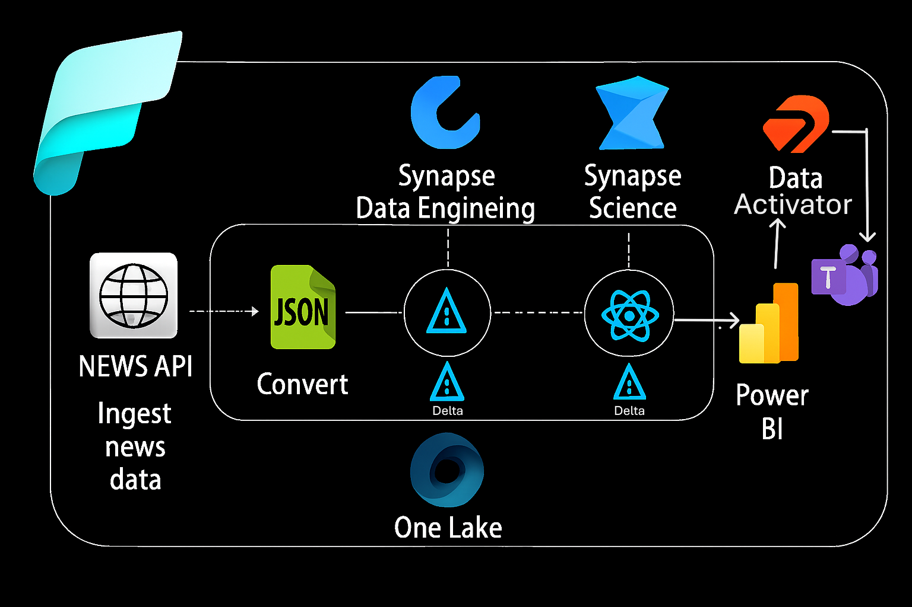
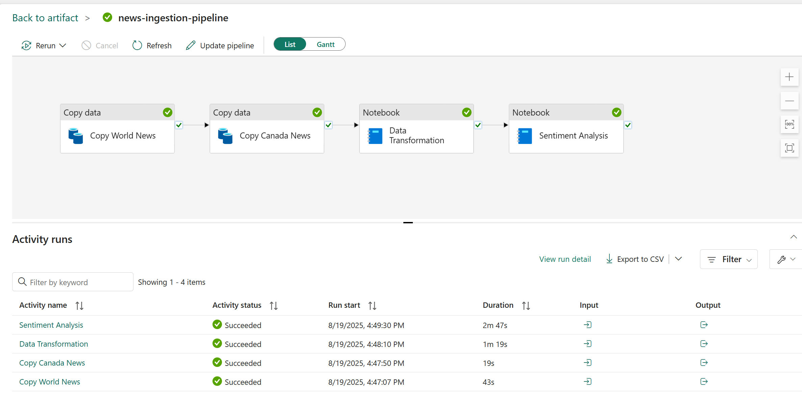
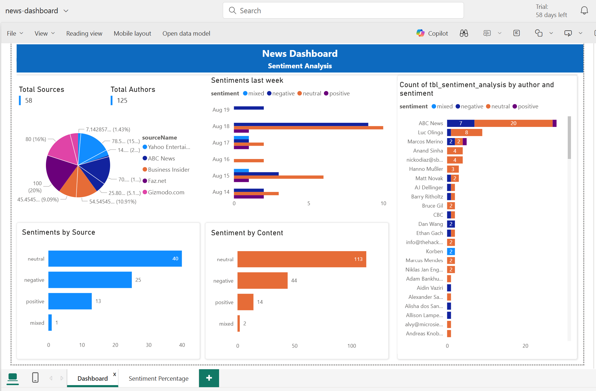
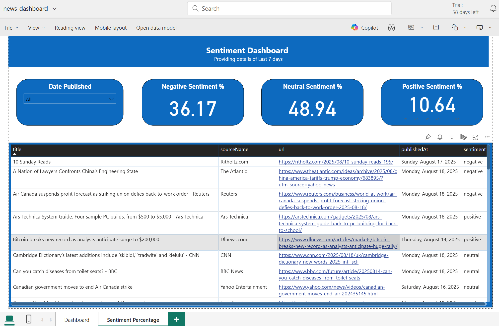
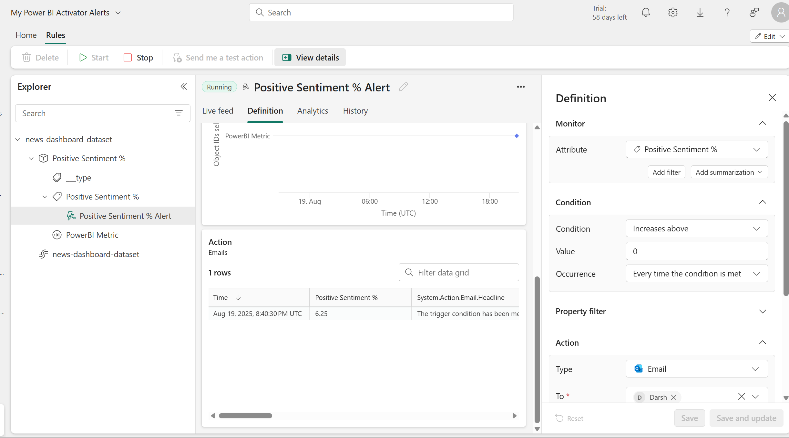

# 📊 News Analytics on Microsoft Azure & Fabric  

## 📌 Project Overview  
This project demonstrates an **end-to-end News Analytics pipeline** built using **Microsoft Azure** and **Microsoft Fabric**.  

The solution automates ingestion of real-time news data, transforms it into structured tables, applies **sentiment analysis** using SynapseML, and delivers insights via **Power BI dashboards** with automated alerts.  

The goal is to showcase how modern cloud-based **data engineering + data science + business intelligence** workflows can be orchestrated seamlessly.  

---

- **Architecture Diagram:**

## 🏗️ Architecture Workflow  

1. **Data Ingestion**  
   - Fetch **latest World and Canada news** from [NewsAPI](https://newsapi.org/).  
   - Store raw JSON files in **Fabric Lakehouse Database** using **Data Factory pipelines**.  

2. **Data Transformation**  
   - Process raw JSON using **Spark notebooks** in Synapse Data Engineering.  
   - Extract attributes: `title`, `description`, `content`, `author`, `url`, `urlToImage`, `source`, `publishedAt`.  
   - Apply **incremental load (Type 1 merge)** to avoid duplicates.  
   - Store transformed data as **Delta Tables** in the Lakehouse.  

3. **Sentiment Analysis**  
   - Use **SynapseML** (pre-trained sentiment analysis model).  
   - Classify news articles as **Positive / Negative / Neutral** based on article descriptions.  
   - Save enriched results back into Lakehouse.  

4. **Reporting & Dashboards**  
   - Build interactive **Power BI dashboards**.  
   - Track **daily sentiment distribution**, trends, and insights from the last 7 days.  
   - Measures include:  
     - % Positive Sentiment  
     - % Negative Sentiment  
     - % Neutral Sentiment  

5. **Alerts & Automation**  
   - Implement **Data Activator** in Power BI.  
   - Configure real-time alerts:  
     - Example: Trigger **Teams/Email alerts** when Negative sentiment exceeds threshold.  
   - Orchestrate all processes using **Data Factory pipelines**.  

---

## ⚙️ Tech Stack  

- **Cloud Platform**: Microsoft Azure & Microsoft Fabric  
- **Data Ingestion & Orchestration**: Azure Data Factory  
- **Data Processing**: Synapse Data Engineering (Apache Spark)  
- **Machine Learning**: SynapseML (Sentiment Analysis)  
- **Data Storage**: Fabric Lakehouse (Delta Tables)  
- **Reporting & Visualization**: Power BI (Semantic Models, Dashboards)  
- **Automation**: Data Activator (Real-time Alerts)  

---

## 📊 Sample Outcomes  

- Automated pipelines fetching **latest World & Canada news**.  
- Structured **Delta tables** with incremental updates.  
- **Sentiment insights** (positive/negative/neutral trends) over time.  
- **Power BI dashboard** for interactive reporting.  
- **Real-time alerts** triggered when negative sentiment spikes.  

---

## 📸 Project Screenshots  

👉 Add your own screenshots in a folder named `images` and link them here:  

- Pipeline Example  
    

- Power BI Dashboard  
  
  
    

- Data Activator Alerts  
    

---

## 🚀 Key Learnings & Impact  

- Built a **scalable, serverless pipeline** with no infrastructure management.  
- Demonstrated **end-to-end integration** of data engineering, machine learning, and BI.  
- Showcased **real-world applicability** of sentiment monitoring for **risk detection and trend analysis**.  

---

## 📌 Tools  

This project highlights practical skills in:  
✔️ **Azure Data Engineering** (Data Factory, Lakehouse, Delta tables)  
✔️ **Machine Learning with SynapseML**  
✔️ **Power BI Dashboarding & Semantic Modeling**  
✔️ **Automation & Real-Time Alerts**  

It demonstrates ability to deliver **end-to-end data solutions**—from raw data ingestion to actionable business insights.  
